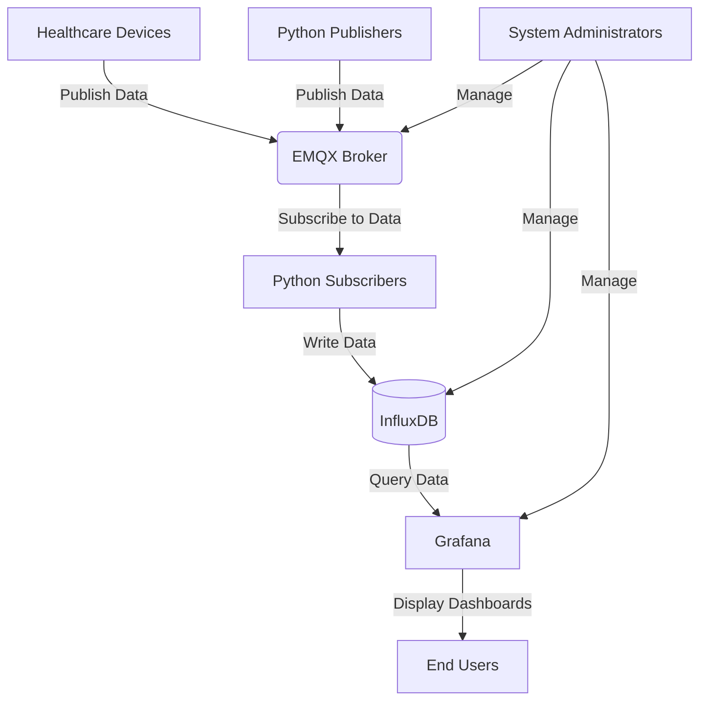

# MQTT Healthcare Monitoring System Architecture

## Overview

The MQTT Healthcare Monitoring System is designed to collect, process, and visualize real-time data from various healthcare devices and sensors. The system is deployed on a NUC (Next Unit of Computing) device, providing a compact yet powerful platform for healthcare monitoring.

## System Components

1. **MQTT Protocol**
   - Lightweight publish-subscribe messaging protocol
   - Enables real-time, bidirectional communication between devices and the central system

2. **EMQX Broker**
   - MQTT message broker
   - Handles message routing between publishers and subscribers
   - Manages client connections and message persistence

3. **InfluxDB**
   - Time-series database
   - Stores sensor data, activity logs, and aggregated metrics
   - Optimized for handling high write and query loads

4. **Grafana**
   - Data visualization and analytics platform
   - Creates dashboards and alerts based on the data in InfluxDB
   - Provides a user-friendly interface for data exploration and monitoring

5. **Python Applications**
   - Publishers: Send data from various sources to the MQTT broker
   - Subscribers: Process incoming MQTT messages and store data in InfluxDB
   - Utility scripts for system management and testing

## Data Flow

1. **Data Ingestion**
   - Healthcare devices and sensors publish data to specific MQTT topics
   - Python publishers can also simulate or aggregate data from multiple sources

2. **Message Brokering**
   - EMQX receives published messages and routes them to appropriate subscribers
   - Handles message QoS (Quality of Service) and persistence as needed

3. **Data Processing**
   - Python subscribers receive messages from relevant topics
   - Subscribers process and transform the data as necessary
   - Processed data is written to InfluxDB

4. **Data Storage**
   - InfluxDB stores time-series data efficiently
   - Organizes data into measurements and tags for optimal querying

5. **Data Visualization**
   - Grafana queries data from InfluxDB
   - Creates real-time dashboards and visualizations
   - Generates alerts based on predefined conditions

## System Interactions

## Key Features

1. **Real-time Data Processing**
   - Low-latency data ingestion and processing
   - Immediate updates to dashboards and alerts

2. **Scalability**
   - EMQX can handle a large number of concurrent device connections
   - InfluxDB efficiently manages high volume time-series data

3. **Flexibility**
   - Easy to add new data sources by creating new MQTT topics and subscribers
   - Customizable data processing logic in Python subscribers

4. **Data Visualization**
   - Grafana provides powerful, customizable dashboards
   - Supports a wide range of visualization types and plugins

5. **Alerting**
   - Grafana can generate alerts based on complex conditions
   - Notifications can be sent via various channels (email, SMS, etc.)

6. **Security**
   - EMQX supports SSL/TLS for secure MQTT communications
   - Authentication and authorization can be implemented at the MQTT broker level
   - InfluxDB and Grafana have built-in authentication mechanisms

## Deployment Considerations

1. **Hardware Requirements**
   - NUC with sufficient CPU, RAM, and storage for all components
   - Consider SSD storage for improved database performance

2. **Networking**
   - Ensure reliable network connectivity for the NUC
   - Configure appropriate firewall rules to secure the system

3. **Backup and Recovery**
   - Implement regular backups of InfluxDB data and system configurations
   - Develop a recovery plan for hardware or software failures

4. **Monitoring and Maintenance**
   - Set up system-level monitoring for the NUC (CPU, memory, disk usage)
   - Regularly update all software components to ensure security and performance

5. **Scalability Planning**
   - Monitor system performance and plan for upgrades as the number of devices or data volume grows
   - Consider distributed architectures for larger deployments in the future

## Conclusion

This architecture provides a robust foundation for a healthcare monitoring system. Its use of industry-standard components (MQTT, EMQX, InfluxDB, Grafana) ensures reliability, scalability, and ease of maintenance. The system's design allows for future expansion and adaptation to changing healthcare monitoring needs.